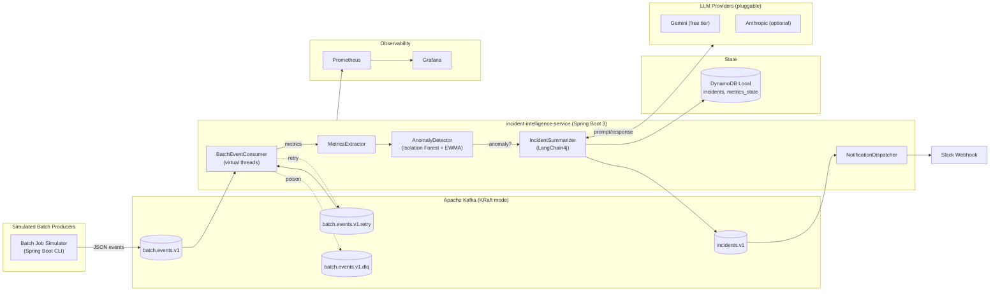

# Batch Incident Intelligence Platform

> Event-driven anomaly detection and AI-generated incident summaries for batch workloads.

[](https://github.com/BibinFrancisK/intelligent-batch-incident-handler/actions/workflows/ci.yml)


---

## Demo

*(Coming in Week 4 — anomaly injection → Slack alert → Grafana dashboard)*

---

## Architecture



See [`docs/architecture.md`](docs/architecture.md) for the full design deep-dive.

---

## Quickstart

**Prerequisites:** Java 21, Docker Desktop (WSL2 backend)

```bash
# 1. Clone
git clone https://github.com/bibinfrancis404/intelligent-batch-incident-handler.git
cd intelligent-batch-incident-handler

# 2. Copy and review env config
cp docker/.env.example docker/.env

# 3. Start infra
docker compose -f docker/docker-compose.yml up -d

# 4. Run the app
./mvnw spring-boot:run -Dspring-boot.run.profiles=local
```

| Endpoint | URL |
|---|---|
| Health | http://localhost:8080/actuator/health |
| Metrics | http://localhost:8080/actuator/prometheus |
| Prometheus | http://localhost:9090 |
| Grafana | http://localhost:3000 (admin / admin) |
| DynamoDB | http://localhost:8000 |

---

## Inject an Anomaly

```bash
./mvnw exec:java -Dexec.mainClass="io.batchintel.simulator.BatchSimulatorRunner" \
  -Dexec.args="--jobType=ANNUITY_PAYOUT --anomaly=true"
```

---

## Tech Stack

| Layer | Technology |
|---|---|
| Runtime | Java 21, Spring Boot 3.3, Virtual Threads (Project Loom) |
| Messaging | Apache Kafka (KRaft), retry topics, DLQ, idempotent producer |
| Persistence | DynamoDB Local (dev) / AWS DynamoDB (prod) |
| Anomaly Detection | Isolation Forest (Smile library), EWMA z-score fallback |
| AI / LLM | LangChain4j → Gemini 1.5 Flash (pluggable via sealed interface) |
| Resilience | Resilience4j circuit breakers, rate limiters |
| Observability | Micrometer, Prometheus, Grafana, OpenTelemetry (log-correlated traces) |
| Infrastructure as Code | Terraform (HCL), Docker Compose |
| Testing | JUnit 5, Testcontainers (Kafka + DynamoDB Local), Spring Boot Test |

---

## Design Decisions

Key architectural choices and their rationale are documented in [`docs/decisions.md`](docs/decisions.md) *(coming Week 4)*.

Notable choices:
- **Sealed interfaces** for `LlmProvider`, `AnomalyDetector`, and `Notifier` — exhaustive pattern matching, swappable at startup via config
- **LLM is out of the critical path** — anomaly persists to DynamoDB and Slack fires even when the LLM circuit-breaker is open
- **KRaft Kafka** (no Zookeeper) — reduces Docker memory footprint by ~300 MB
- **EWMA z-score ships before Isolation Forest** — always-available baseline, zero dependencies

---

## Running Tests

```bash
# All tests (unit + integration + E2E via Testcontainers)
./mvnw verify

# Single test class
./mvnw -Dtest=EwmaAnomalyDetectorTest test
```

---

## What I Would Do Next

- Avro + Confluent Schema Registry for stricter schema evolution
- Anthropic provider wired behind the same `LlmProvider` sealed interface
- DLQ replay CLI tool
- GitHub Actions CI pipeline (build + test + container image → GHCR)
- Real AWS deployment via Terraform (`infra/terraform/`) against a free-tier account
