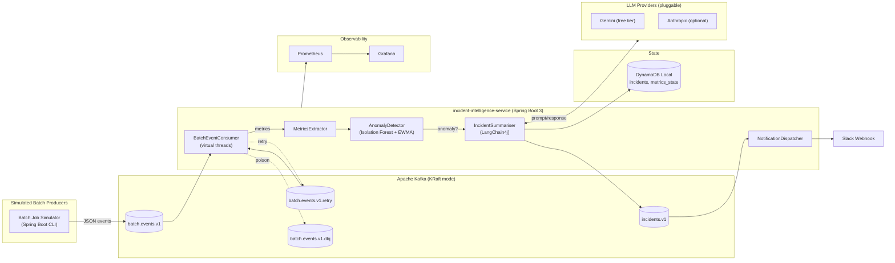
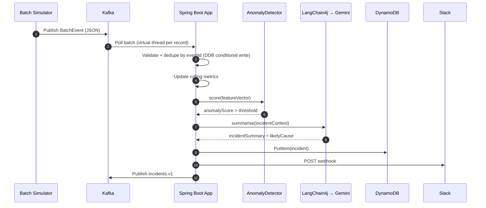
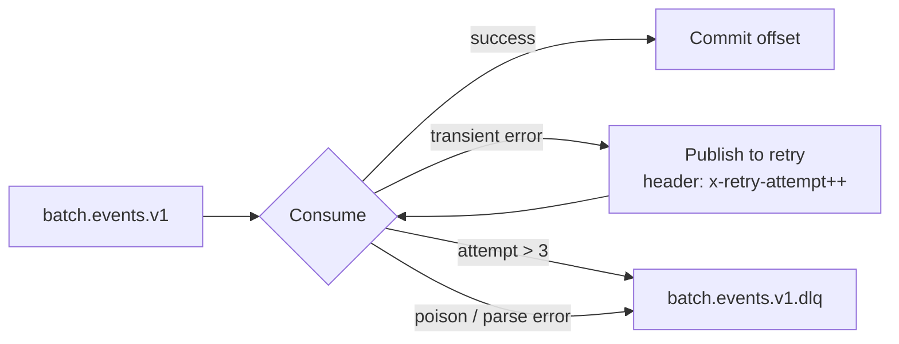

# Architecture

## System Diagram

---

## Data Flow (Happy Path)

---

## Retry and DLQ Flow

---

## Component Responsibilities

| Component | Responsibility |
|---|---|
| `BatchSimulatorRunner` | Emits structured `BatchEvent`s for 3 job types; supports `--anomaly=true` injection mode |
| `BatchEventConsumer` | At-least-once consumption; idempotency via DynamoDB conditional `PutItem`; routes failures to retry/DLQ |
| `MetricsExtractor` | Aggregates rolling metrics per `jobType` (row count, duration, error rate) into `metrics_state` |
| `AnomalyDetector` | Sealed interface — `EwmaAnomalyDetector` (baseline) or `IsolationForestDetector` (advanced), selected via config |
| `IncidentSummariser` | Builds bounded context prompt → calls active `LlmProvider` → produces structured `IncidentSummary` |
| `SlackNotifier` | Posts incident to Slack webhook; deduped by `IncidentFingerprint` |
| DynamoDB | Stores `incidents`, `metrics_state`, `processed_events` (idempotency keys with TTL) |
| Grafana | 6-panel dashboard: throughput, error rate, p95 duration, anomaly scores, incidents by severity, LLM latency |

---

## Key Design Decisions

| Decision | Rationale |
|---|---|
| Sealed interfaces for `LlmProvider`, `AnomalyDetector`, `Notifier` | Exhaustive pattern matching; swappable at startup via `application.yml` |
| LLM out of the critical path | Anomaly persists even if Gemini is down; incident written with `summary=null` tagged `llm_unavailable` |
| KRaft Kafka (no Zookeeper) | Saves ~300 MB Docker RAM on a 16 GB dev machine |
| Virtual threads on consumer executor | IO-bound workload; poll loop stays on platform thread (safe) |
| DynamoDB Local over Postgres | Schema-less, matches the AWS CDK stack, no migration tooling needed at this scope |
| EWMA z-score as baseline detector | 30 lines, zero dependencies, always warm — ships before Isolation Forest |
| `cdk synth` only, never `cdk deploy` | Zero AWS cost; IaC code in `infra/cdk/` is reference architecture only |
