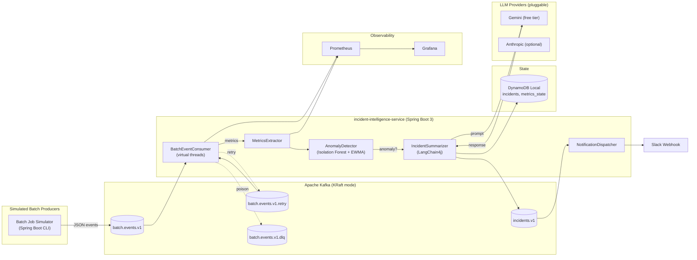
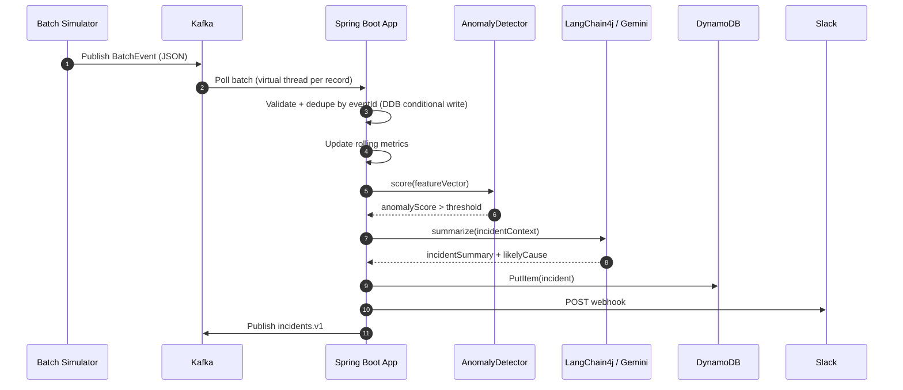
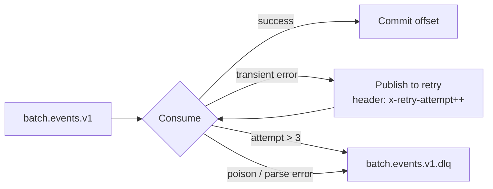

# Architecture

## System Diagram



---

## Data Flow (Happy Path)



---

## Retry and DLQ Flow



---

## Component Responsibilities

| Component | Responsibility |
|---|---|
| `BatchSimulatorRunner` | Emits structured `BatchEvent`s for 3 job types; supports `--anomaly=true` injection mode |
| `BatchEventConsumer` | At-least-once consumption; idempotency via DynamoDB conditional `PutItem`; routes failures to retry/DLQ |
| `MetricsExtractor` | Aggregates rolling metrics per `jobType` (row count, duration, error rate) into `metrics_state` |
| `AnomalyDetector` | Sealed interface — `EwmaAnomalyDetector` (baseline) or `IsolationForestDetector` (advanced), selected via config |
| `IncidentSummarizer` | Builds bounded context prompt → calls active `LlmProvider` → produces structured `IncidentSummary` |
| `SlackNotifier` | Posts incident to Slack webhook; deduped by `IncidentFingerprint` |
| DynamoDB | Stores `incidents`, `metrics_state`, `processed_events` (idempotency keys with TTL) |
| Grafana | 6-panel dashboard: throughput, error rate, p95 duration, anomaly scores, incidents by severity, LLM latency |

---

## BatchEvent Schema

Every message published to `batch.events.v1` is a `BatchEvent` envelope. The `eventType` field inside `payload` is the Jackson polymorphic discriminator — it determines which sealed subtype is deserialized.

### Event types

| `eventType` | Payload record | Purpose |
|---|---|---|
| `JOB_STARTED` | `JobStarted` | Job kicked off; carries expected row count |
| `JOB_PROGRESS` | `JobProgress` | Periodic heartbeat; carries rows processed so far and % complete |
| `JOB_COMPLETED` | `JobCompleted` | **Primary anomaly signal** — carries final row count, duration, and error count |
| `JOB_FAILED` | `JobFailed` | Terminal failure; carries error code and retry count |

### `JOB_COMPLETED` — primary anomaly signal

`JobCompleted` is the event the anomaly detector scores. `durationSeconds` and `errorCount` are the key features — a 5× duration spike or an error rate above baseline both trigger incident creation.

```json
{
  "eventId": "550e8400-e29b-41d4-a716-446655440003",
  "schemaVersion": "v1",
  "jobType": "ANNUITY_PAYOUT",
  "timestamp": "2024-01-15T02:03:00Z",
  "payload": {
    "eventType": "JOB_COMPLETED",
    "runId": "run-2024-0115-001",
    "rowsProcessed": 150000,
    "durationSeconds": 182.5,
    "errorCount": 0,
    "sourceFile": "annuity_export_2024_0115.csv"
  }
}
```

### Schema evolution rules

- `schemaVersion` is stamped on every message (`"v1"` currently).
- Consumers set `FAIL_ON_UNKNOWN_PROPERTIES=false` — new fields added by producers are silently ignored.
- Breaking changes (field removal, rename, type change) require a new topic version (`batch.events.v2`).
- `src/test/resources/fixtures/batch-event-v1-sample.json` is the schema contract — a parsing failure there signals a breaking change.

---

## Persistence & Metrics

### DynamoDB tables

| Table | Partition key | Purpose |
|---|---|---|
| `processed_events` | `eventId` (String) | Idempotency store — one row per processed event, 24h TTL |
| `metrics_state` | `jobType` (String) | Cumulative rolling metrics per job type: count, sum of durations, error count, row count |
| `incidents` | `incidentId` (String) | Persisted incident records produced by the anomaly + LLM pipeline |

### Conditional-write dedupe

`DynamoIdempotencyStore.isNew(eventId)` attempts a `PutItem` with `attribute_not_exists(eventId)`. If the write succeeds, the event is first-seen and proceeds through the pipeline. If DynamoDB throws `ConditionalCheckFailedException`, a duplicate is silently skipped. This is an atomic partition-level operation — no read-before-write race window.

### Dual metrics path

Two independent metrics mechanisms run in parallel:

- **Durable aggregate (`metrics_state` table)** — `MetricsRepository.accumulate()` issues a DynamoDB `ADD` expression that increments `count`, `sumDurationSeconds`, `sumErrorCount`, and `sumRows` atomically server-side. These survive restarts and feed the Week 3 anomaly detector with historical baselines.
- **In-process Micrometer** (`BatchMetrics`) — a `Counter` (events processed), a `Timer` (job duration → p95), and a per-`jobType` `Gauge` (live error rate) are registered on startup. Prometheus scrapes `/actuator/prometheus`; Grafana reads Prometheus. This path is ephemeral (resets on restart) but provides real-time dashboard visibility.

---

## Key Design Decisions

| Decision | Rationale |
|---|---|
| Sealed interfaces for `LlmProvider`, `AnomalyDetector`, `Notifier` | Exhaustive pattern matching; swappable at startup via `application.yml` |
| LLM out of the critical path | Anomaly persists even if Gemini is down; incident written with `summary=null` tagged `llm_unavailable` |
| KRaft Kafka (no Zookeeper) | Saves ~300 MB Docker RAM on a 16 GB dev machine |
| Virtual threads on consumer executor | IO-bound workload; poll loop stays on platform thread (safe) |
| DynamoDB Local over Postgres | Schema-less, matches the AWS CDK stack, no migration tooling needed at this scope |
| EWMA z-score as baseline detector | 30 lines, zero dependencies, always warm — ships before Isolation Forest |
| `cdk synth` only, never `cdk deploy` | Zero AWS cost; IaC code in `infra/cdk/` is reference architecture only |
