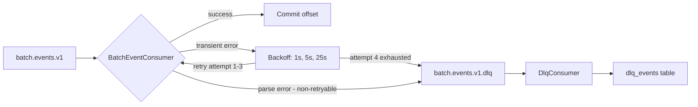

# Kafka Design

## Topic Strategy

Topic naming follows the convention `<domain>.<event>.v<version>[.retry|.dlq]`. The version suffix allows blue/green schema evolution — a breaking change increments the suffix (e.g. `batch.events.v2`) rather than mutating the existing topic.

| Topic | Partitions | Retention | Purpose |
|---|---|---|---|
| `batch.events.v1` | 3 | 7 days | Primary event stream from the simulator |
| `batch.events.v1.retry` | 3 | 3 days | Reserved for future retry-topic pattern; not used by the current in-memory retry strategy |
| `batch.events.v1.dlq` | 1 | 14 days | Terminal failures — poison messages and records exhausting all retries |
| `incidents.v1` | 3 | 30 days | Downstream fan-out for anomaly incidents (future: notification service, analytics) |

Partition key is always `jobType` — this preserves ordering within each insurance/annuity job stream across consumer restarts. A single partition for the DLQ is intentional: volume is low and ordering of failures is not critical.

Topics are created by `docker/kafka-init.sh` on first boot via the `kafka-init` container, which depends on the `kafka` service health check before running.

---

## Retry and DLQ Flow

The retry strategy is **in-memory exponential backoff** via Spring Kafka's `DefaultErrorHandler`. Failed records are retried on the same consumer thread with increasing delays before the recoverer routes them to the DLQ.



**Backoff schedule** — `ExponentialBackOffWithMaxRetries(3)`:

| Attempt | Action |
|---|---|
| 1 | Immediate failure |
| 2 | Wait 1 s, retry |
| 3 | Wait 5 s, retry |
| 4 | Wait 25 s, retry |
| — | Exhausted → `DeadLetterPublishingRecoverer` publishes to DLQ |

**Poison messages** (`JsonProcessingException` and its subtypes) skip all retries and route straight to the DLQ on the first failure. Retrying a structurally broken message wastes 31 seconds for zero benefit. The classifier traverses the exception cause chain, so `RuntimeException` wrapping a `JsonProcessingException` is correctly detected.

**DLQ record headers** — `DeadLetterPublishingRecoverer` stamps the following headers on every DLQ record:

| Header | Content |
|---|---|
| `x-retry-attempt` | Number of delivery attempts (from `RetryHeaders`) |
| `kafka_dlt-exception-fqcn` | Fully-qualified exception class name |
| `kafka_dlt-exception-message` | Exception message text |
| `kafka_dlt-original-topic` | Source topic |
| `kafka_dlt-original-partition` | Source partition |
| `kafka_dlt-original-offset` | Source offset |

`DlqConsumer` reads `x-retry-attempt` and `kafka_dlt-exception-message` to produce a structured log entry, then persists the record to the `dlq_events` DynamoDB table for later inspection and replay.

---

## Consumer Group Design

| Group ID | Listener | Purpose |
|---|---|---|
| `incident-intelligence` | `BatchEventConsumer` | Main processing — metrics extraction, idempotency |
| `incident-intelligence-dlq` | `DlqConsumer` | DLQ monitoring — distinct group so offsets are tracked independently |

Using a separate group for the DLQ consumer ensures that a rebalance in the main group does not affect DLQ offset tracking, and vice versa.

Both consumers use the same **virtual-thread executor** (`SimpleAsyncTaskExecutor` with `setVirtualThreads(true)`). Virtual threads are ideal here: the workload is IO-bound (DynamoDB, Kafka), and virtual threads park on blocking calls rather than consuming OS thread pool capacity.

The poll loop stays on a platform thread (safe: Kafka's `KafkaConsumer` is not thread-safe); virtual threads are used only for the listener callback invocations.

---

## Idempotency

**Producer side** — `enable.idempotence=true` with `acks=all` guarantees exactly-once delivery from the simulator to the broker. Duplicate records due to producer retries are prevented at the Kafka protocol level.

**Consumer side** — `BatchEventConsumer` performs a DynamoDB conditional `PutItem` on the `processed_events` table before any processing:

```
condition: attribute_not_exists(eventId)
```

If the condition fails (`ConditionalCheckFailedException`), the event has already been processed and is silently skipped. The TTL on `processed_events` items is 24 hours — sufficient to cover any realistic at-least-once redelivery window while keeping the table small.

This two-layer approach (producer idempotence + consumer conditional write) ensures that even if Kafka redelivers a message after a consumer crash, the processing side effects (metrics update, DynamoDB write) happen exactly once.

---

## Non-Retryable Exception Classification

`DefaultErrorHandler` classifies exceptions as retryable or non-retryable before applying the backoff schedule. The internal `ExtendedBinaryExceptionClassifier` traverses the full exception cause chain, so wrapped exceptions are correctly matched.

| Exception | Classification | Reason |
|---|---|---|
| `JsonProcessingException` | Non-retryable | Structural parse failure — no amount of retrying will fix a malformed payload |
| `DeserializationException` | Non-retryable | Kafka-level deser failure (default in Spring Kafka's classifier) |
| `MessageConversionException` | Non-retryable | Type conversion failure (default) |
| `ClassCastException` | Non-retryable | Type mismatch (default) |
| `DynamoDbException` (transient) | Retryable | Network/throttle — worth retrying with backoff |
| Any other `RuntimeException` | Retryable | Default: retry until backoff exhausted |

Non-retryable exceptions are added via `errorHandler.addNotRetryableExceptions(JsonProcessingException.class)` in `KafkaErrorHandlerConfig`. Spring Kafka's defaults cover the remainder of the table above.
